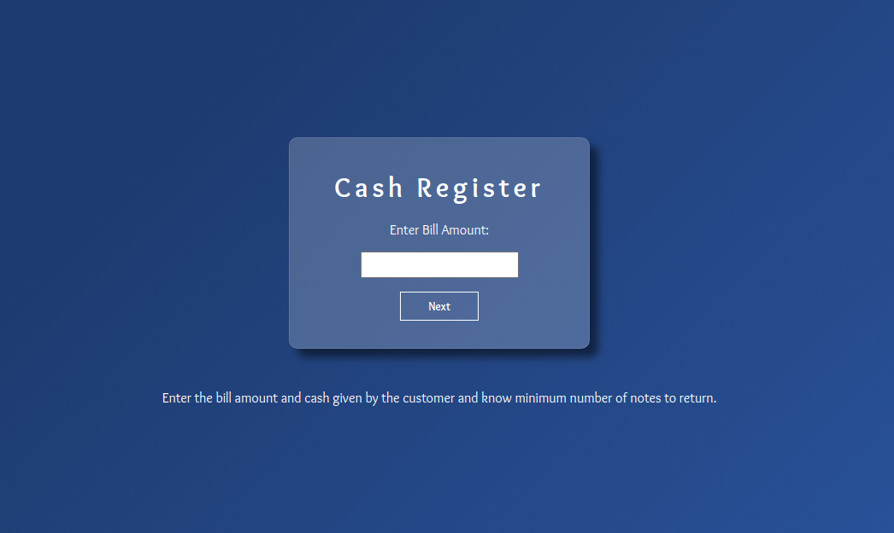

# neoG - Mark-10 Cash Register

This is a solution to the [Mark-10 of neoG camp](https://neog.camp/guide/mark-10).

## Table of contents

- [Overview](#overview)
  - [The challenge](#the-challenge)
  - [Screenshot](#screenshot)
  - [Links](#links)

## Overview
- This app tells the user how can he/she return the change to the customer with a minimum number of notes.

### The challenge

- Your program has currencies of Rs. 1, 5, 10, 20, 100, 500, 2000.
- Your user enters a bill amount.
- Your user then enters cash given.
- Now, help the user by telling how can he/she return the change to the customer with a minimum number of notes?

### Screenshot

### Links

[- Live Site URL](https://git-0r.github.io/mark10_cashRegister/)
